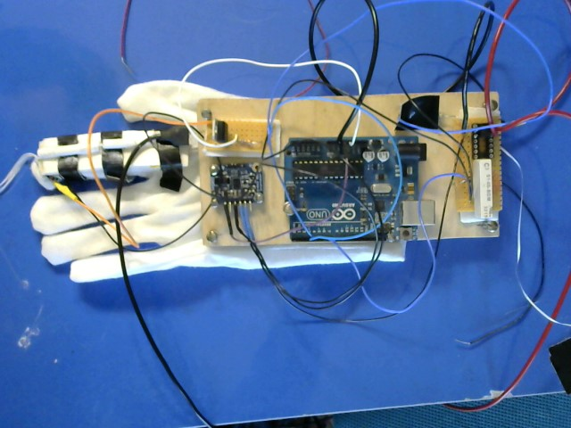
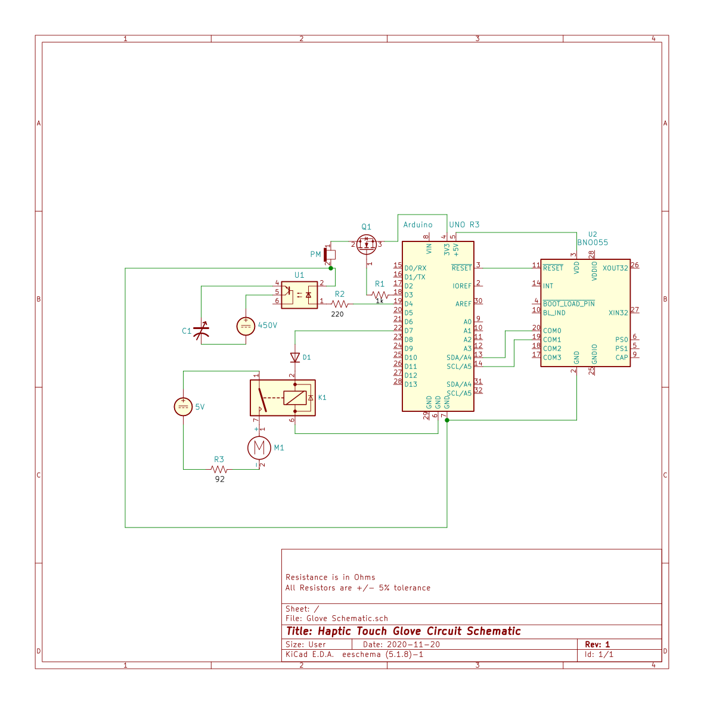

# ArduinoDataGloveHV
Arduino Data Glove using custom Capactior and High Voltage Power Source
This was an Honors Capstone project that included a practical build, demo and paper.  This is the code.
Physical Design:

Circuit Diagram:

